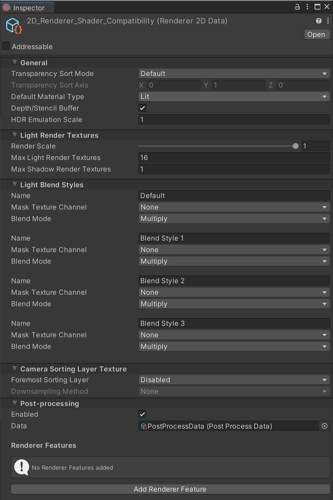

# Configure the 2D Renderer Asset

The **2D Renderer Data** Asset contains the settings that affect the way **2D Lights** are applied to lit Sprites. You can set the way Lights emulate HDR lighting with the [HDR Emulation Scale](HDREmulationScale.md), or customize your own [Light Blend Styles](LightBlendStyles.md). Refer to their respective pages for more information about their properties and options.

## Default Material Type

Unity assigns a Material of the selected **Default Material Type** to Sprites when they are created. The available options have the following properties and functions.

**Lit**:  Unity assigns a Material with the Lit type (default Material: Sprite-Lit-Default). 2D Lights affect Materials of this type.

**Unlit**: Unity assigns a Material with the Unlit type (default Material:  Sprite-Lit-Default). 2D Lights do not affect Materials of this type.

**Custom**: Unity assigns a Material with the Custom type. When you select this  option, Unity shows the **Default Custom Material** box. Assign the desired Material to this box.

## Use Depth/Stencil Buffer

This option is enabled by default. Clear this option to disable the Depth/[Stencil](https://docs.unity3d.com/Manual/SL-Stencil.html) Buffer. Doing so might improve your project’s performance, especially on mobile platforms. You should clear this option if you are not using any features that require the Depth/Stencil Buffer (such as [Sprite Mask](https://docs.unity3d.com/Manual/class-SpriteMask.html)).

## Camera Sorting Layer Texture

The **2D Renderer Data** specifies how Unity supplies the shader variable `CameraSortingLayerTexture` for use in custom shaders. It is recommended that you use this data in the same frame and on the following layers, as using `CameraSortingLayerTexture` before it has been captured may result in unexpected results.

### Foremost Sorting Layer

All Layers captured for use in the supplied Texture will be drawn from the very back Layer up to and including the Layer specified by **Foremost Sorting Layer**.

### Downsampling Method

Downsampling reduces the Texture resolution used by `CameraSortingLayerTexture`. The options are: **None**, **2x Bilinear**, **4x Box**, **4x Bilinear**.

## Renderer Features

The 2D Renderer supports [URP Renderer Features](urp-renderer-feature.md). The setup for the features are called before any of the 2D built-in passes are queued. Refer to the [URP Renderer Features](urp-renderer-feature.md) documentation for more information.
