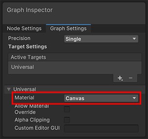

# Canvas Shader Graph

The Canvas material type enables you to author Shader Graph shaders that can be applied to [UGUI user interface elements](https://docs.unity3d.com/Packages/com.unity.ugui@1.0/manual/UICanvas.html).

 *Shader Graph with the Canvas Material type*

## Create a Canvas Shader Graph

To create a Canvas material in Shader Graph, use one of the following methods:

* Modify an existing Shader Graph.
    1. Open the Shader Graph in the Shader Editor.
    2. In **Graph Settings**, select the **Universal** Target. If there isn't one, go to **Active Targets,** click the **Plus** button, and select **Universal**.
    3. In the **Material** drop-down, select **Canvas**.
* Create a new Shader Graph. Go to **Assets** > **Create** > **Shader Graph** > **URP** and click **Canvas Shader Graph**.

## Contexts

This material type comes with a distinct set of Graph Settings, which significantly affects the Blocks relevant to the Graph. This section provides details regarding the Blocks automatically added by default in this Master Stack material type and the Blocks that determine properties for the Graph Settings of this material type.

### Vertex Context

The Vertex context represents the vertex stage of this shader. Unity executes any block you connect to this context in the vertex function of this shader. For more information, refer to [Master Stack](https://docs.unity3d.com/Packages/com.unity.shadergraph@17.0/manual/Master-Stack.html).

Vertex blocks are not compatible with the Canvas Master Stack.

### Fragment Context

The Fragment Context contains the default and relevant Blocks for the Canvas material.

#### Default Fragment Context

When you create a new Canvas material, the Fragment Context contains the following Blocks by default:

<table>
<tr>
<th>Property</th>
<th>Description</th>
<th>Setting Dependency</th>
<th>Default Value</th>
</tr>
<tr>
<td>**Base Color**</td>
<td>The base color of the material.</td>
<td>None</td>
<td>Color.grey</td>
</tr>
<tr>
<td>**Alpha**</td>
<td>The Material's alpha value. This determines how transparent the material is. The expected range is 0 - 1.</td>
<td>None</td>
<td>1.0</td>
</tr>
<tr>
<td>**Emission**</td>
<td>The color of light to emit from this material's surface. Emissive materials appear as a source of light in your scene.</td>
<td>None</td>
<td>Color.black</td>
</tr>
</table>

#### Relevant Fragment Context

Depending on the [Graph Settings](#graph-settings) you use, Shader Graph might add the following Blocks to the Fragment Context:

<table>
<tr>
<th>Property</th>
<th>Description</th>
<th>Setting Dependency</th>
<th>Default Value</th>
</tr>
<tr>
<td>**Alpha Clip Threshold**</td>
<td>The alpha value limit that URP uses to determine whether to render each pixel. If the alpha value of the pixel is equal to or higher than the limit, URP renders the pixel. If the value is lower than the limit, URP does not render the pixel. The default value is 0.5.</td>
<td>**Alpha Clipping** enabled</td>
<td>0.5</td>
</tr>

## Graph Settings

The following table describes the Surface Options in the Graph Settings:

<table>
<tr>
<th>Property</th>
<th>Description</th>
</tr>
<tr>
<td>**Material Type**</td>
<td>Specifies a type for the material. This allows you to customize the material with different settings depending on the type you select. The options are: &#8226; **Sprite Custom Lit**:  &#8226; **Sprite Lit**:  &#8226; **Sprite Unlit**:  &#8226; **Canvas**:  &#8226; **Decal**:  &#8226; **Fullscreen**:  &#8226; **Lit**:  &#8226; **Unlit**: </td>
</tr>
<tr>
<td>**Alpha Clipping**</td>
<td>

Indicates whether this material acts like a [Cutout Shader](https://docs.unity3d.com/Manual/StandardShaderMaterialParameterRenderingMode.html). For more information about the feature and for the list of properties this feature exposes, refer to [Alpha Clipping documentation](../../com.unity.render-pipelines.high-definition/Documentation~/Alpha-Clipping.md).

</td>
</tr>

