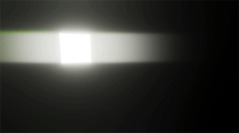

# Screen Space Lens Flare override reference

Refer to [Add screen space lens flares](post-processing-screen-space-lens-flare.md) for more information.

## Properties

| **Property** | **Description** |
| - | - |
| **Intensity** | Set the strength of all the types of lens flares. If the value is 0, URP doesn't calculate or render any lens flares. The default is 0. |
| **Tint Color** | Set the color URP uses to tint all the types of lens flares. The default is white. |
| **Bloom Mip Bias** | Set the mipmap level URP uses to sample the Bloom pyramid and create the lens flares. The higher the mipmap level, the smaller and more pixelated the sample source, and the blurrier the result. The range is 0 through 5. 0 is the full-resolution mipmap level. The default is 1. Refer to [Mipmaps introduction](https://docs.unity3d.com/2023.1/Documentation/Manual/texture-mipmaps-introduction.html) for more information. This property only appears if you open the **More** (⋮) menu and select **Advanced Properties**. |

### Flares

Use the **Flares** settings to control regular flares, reversed flares and warped flares.

| **Property** || **Description** |
|-|-|-|
| **Regular Multiplier** || Set the strength of regular flares. If the value is 0, URP doesn't calculate or render regular flares. The default is 1. |
| **Reversed Multiplier** || Set the strength of reversed flares. If the value is 0, URP doesn't calculate or render reversed flares. The default is 1. |
| **Warped Multipler** || Set the strength of warped flares. If the value is 0, URP doesn't calculate or render warped flares. The default is 1. |
|| **Scale** | Scale the width (**x**) and height (**y**) of warped flares. The defaults are 1. This property only appears if you open the **More** (⋮) menu and select **Advanced Properties**. |
| **Samples** || Set the number of times URP repeats the regular, reversed and warped flares. The range is 1 through 3. The default is 1. Increasing **Samples** has a big impact on performance. |
|| **Sample Dimmer** | Set the strength of the lens flares URP adds if you set **Samples** to 2 or 3. The higher the value, the less intense the flares. This property only appears if you open the **More** (⋮) menu and select **Advanced Properties**. |
| **Vignette Effect** || Set the strength of the regular, reversed and warped flares in a circular area in the center of the screen. Use **Vignette Effect** to avoid lens flare obscuring the scene too much. The default value is 1, which means URP doesn't render flares at the center of the screen. |
| **Starting Position** || Control how far the position of the regular, reversed and warped flares differ from the bright area they're sampled from, in metres. If the value is 0, URP places the lens flares at the same position as the bright areas they're sampled from. The range is 1 through 3. The default is 1.25. |
| **Scale** || Set the size of regular, reversed and warped lens flares. The range is 1 through 4. The default is 1.5. |

### Streaks

Use the **Streaks** settings to control flares stretched in one direction.

| **Property** || **Description** |
|-|-|-|
| **Multiplier** || Set the strength of streaks. If the value is 0, URP doesn't calculate or render streaks. The default is 1. |
|| **Length** | Set the length of streaks. The range is 0 through 1. 1 is the approximate width of the screen. The default value is 0.5. |
|| **Orientation** | Set the angle of streaks, in degrees. The default value is 0, which creates horizontal streaks. |
|| **Threshold** | Control how localized the streak effect is. The higher the **Threshold**, the more localized the effect. The range is 0 through 1. The default value is 0.25. |
|| **Resolution** | Control the resolution detail of streaks. URP renders lower-resolution streaks faster. The options are **Half**, **Quarter** and **Eighth** full resolution. This property only appears if you open the **More** (⋮) menu and select **Advanced Properties**. |

 
The effect of changing **Threshold** from 0 (a larger flare effect) to 1 (a smaller flare effect).

### Chromatic Aberration

Use the **Chromatic Aberration** settings to control chromatic aberration on all the lens flare types. Chromatic aberration splits light into its color components, which mimics the effect that a real-world camera produces when its lens fails to join all colors to the same point.

The chromatic aberration effect is strongest at the edges of the screen, and decreases in strength towards the center of the screen.

| **Property** | **Description** |
|-|-|
| **Intensity** | Set the strength of the chromatic aberration effect. If the value is 0, URP doesn't split the colors. |
